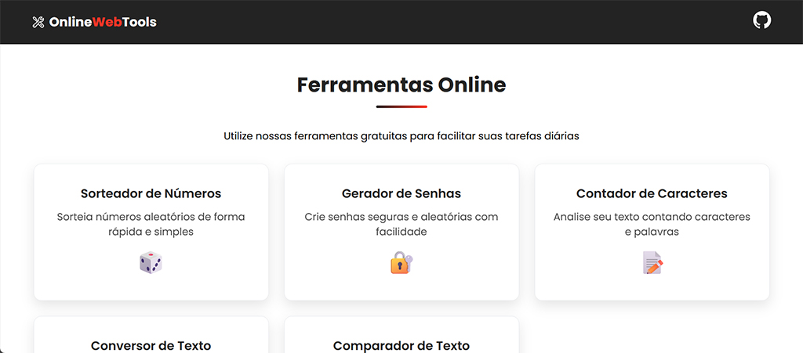

Languages: 🇺🇸 [English](README.md) · 🇧🇷 [Português](README.pt-BR.md) · 🇪🇸 [Español](README.es.md)

---

# 🛠️ Online Web Tools


## 📋 Overview

A collection of free and accessible web tools for daily use. This project consists of an intuitive website with a home page and five useful applications, each designed to solve specific problems.

## 🔗 Live Preview

## 📱 Screenshot

<div align="center">
  
</div>

## 🧰 Available Tools

### 🎲 Random Number Generator
Generate random numbers quickly within custom ranges.

### 🔐 Random Password Generator
Create secure and random passwords with customizable complexity options.

### 🔄 Text Converter
Easily transform text between uppercase and lowercase.

### 📊 Word and Character Counter
Analyze your text with detailed word and character statistics.

### 🔍 Text Comparator
Compare two texts and identify the differences between them.

## 📱 Responsiveness

The website layout was carefully designed to be fully responsive, ensuring a consistent and pleasant experience across:

- 💻 Desktops
- 💻 Laptops
- 📱 Tablets
- 📱 Smartphones

## 🧩 Technologies Used

This project was built using fundamental web technologies, with no external dependencies:

- **HTML5** — Semantic structuring  
- **CSS3** — Modern and responsive styling  
- **JavaScript** — Logic and interactivity  
- **Vite** — Build and optimization  

## 📁 Folder Structure

```
online-web-tools/
├── index.html # Home page
├── pages/ # Individual applications
│ ├── sorteador/ # Number generator
│ ├── gerador-de-senhas/ # Password generator
│ ├── conversor-de-texto/ # Text converter
│ ├── contador-de-caracteres/ # Word counter
│ └── comparador-de-texto/ # Text comparator
├── assets/ # Shared resources
│ ├── css/
│ └── js/
└── dist/ # Production-ready build
```

## 🚀 How to Run Locally

### Prerequisites

- Node.js (recommended version: 14.x or higher)
- npm or yarn

### Installation

Clone this repository:

```
git clone https://github.com/WillianDDaniel/online-web-tools
```

Navigate to the project directory:

```
cd online-web-tools
```

Install the dependencies:

```
npm install
```

or

```
yarn
```

Start the development server:

```
npm run dev
```

or

```
yarn dev
```

Open your browser and access:

```
http://localhost:5173/online-web-tools/
```

## 📦 Production Build

To generate an optimized version for production:

```
npm run build
```

or

```
yarn build
```

The build files will be available in the `dist/` folder.

## 🤝 How to Contribute

Contributions are always welcome! Follow these steps:

1. Fork the project  
2. Create your feature branch (`git checkout -b feature/AmazingFeature`)  
3. Commit your changes (`git commit -m 'Add some AmazingFeature'`)  
4. Push to the branch (`git push origin feature/AmazingFeature`)  
5. Open a Pull Request  

## 🐛 Reporting Issues

Found a bug or have a suggestion? Open an issue detailing the problem or proposed improvement.

## 📜 License

This project is licensed under the MIT License — see the `LICENSE` file for details.